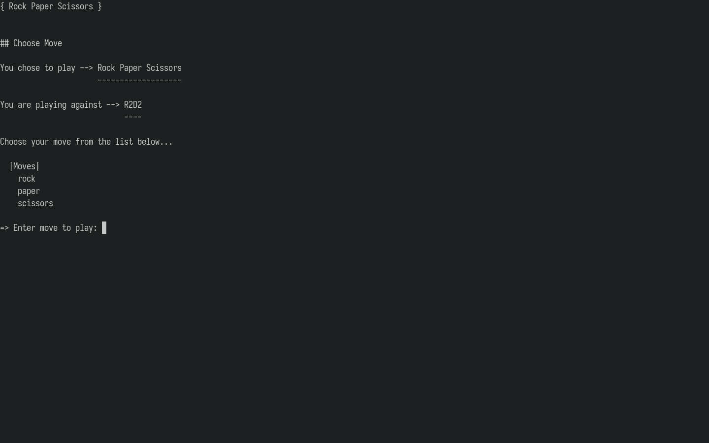

# rps-game



## About
`rps-game` is a simple terminal Rock Paper Scissors game, where the player competes against a computer that chooses different 'personalities' each round. You may choose to play as many rounds as you like.

Game version include vanilla Rock Paper Scissors and the more complicated Lizard Spock (See [the game rules here](https://bigbangtheory.fandom.com/wiki/Rock,_Paper,_Scissors,_Lizard,_Spock)).

## Dependencies

`rps-game` requires the following:

- `Ruby (>= 2.7.0)` (The programming language `rps-game` is written in. See [the official Ruby installation procedures](https://www.ruby-lang.org/en/documentation/installation/).)

## Installation

To install `rps-game`, simply clone this repository to your machine and navigate to the `rps-game` folder created:

```
$ git clone https://github.com/loreandstory/rps-game.git
$ cd rps-game/
```

## Running

You must be `cd`'d into the `rps-game` folder and execute the `play.sh` file to play:

```
$ cd /path/to/rps-game/
$ ./play.sh
```

Note that you can exit the game at any time by pressing `Ctrl-c`. Otherwise, you may enter `n` at the end of each round to exit, or enter `y` to play another round. You can also view the game history and statistics by entering `hist` or `stat`. Study them to figure out how each computer 'personality' plays!
